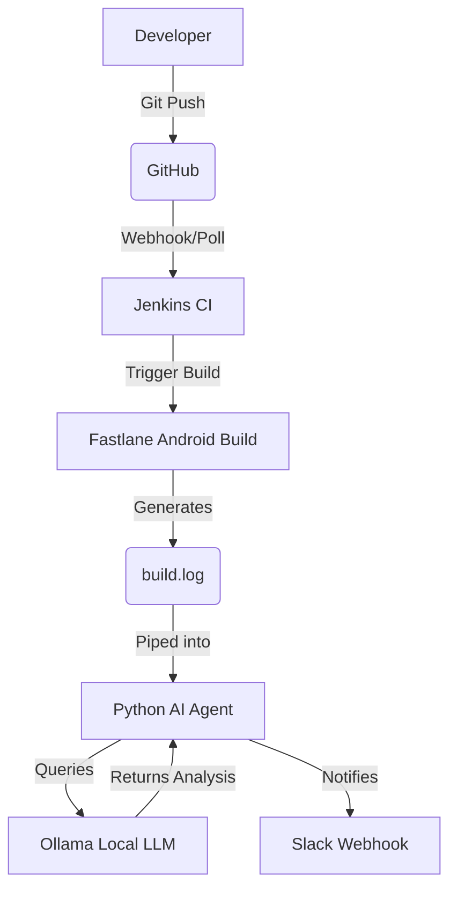

# 🚀 AI‑Powered Android CI/CD Pipeline

[](https://www.jenkins.io/)
[](https://www.docker.com/)
[](https://fastlane.tools/)
[](https://ollama.ai/)
[](https://www.python.org/)

**Complete Step‑by‑Step Tutorial + Portfolio Handbook**  
*Jenkins · Docker · Fastlane · Local AI (Ollama) · Slack*

---

## 📑 Table of Contents
- [Part 1: Full Tutorial (Beginner Friendly)](#part-1-full-tutorial-beginner-friendly)
  - [1. What You Are Building](#1-what-you-are-building)
  - [2. Prerequisites](#2-prerequisites)
  - [3. Environment Setup](#3-environment-setup)
  - [4. Jenkins & Ollama Setup](#4-jenkins--ollama-setup)
  - [5. Android & Fastlane Setup](#5-android--fastlane-setup)
  - [6. AI Agent Integration](#6-ai-agent-integration)
  - [7. Jenkins Pipeline Configuration](#7-jenkins-pipeline-configuration)
  - [8. Slack Integration](#8-slack-integration)
- [Part 2: Portfolio Handbook Summary](#part-2-portfolio-handbook-summary)
  - [Architecture Overview](#architecture-overview)
  - [Resume‑Ready Description](#resume-ready-description)

---

## 🛠️ PART 1: FULL TUTORIAL (BEGINNER FRIENDLY)

Follow this section line‑by‑line. No prior DevOps, Jenkins, or AI knowledge required.

### 1. What You Are Building
You are building an AI‑powered Android CI/CD pipeline that:
- 🏗️ **Builds** an Android app using Fastlane.
- 🐛 **Captures** real Gradle build errors.
- 🤖 **Uses** a local AI model to explain:
  - ✅ Exact error message
  - ✅ Root cause
  - ✅ Suggested fix (short)
- 📢 **Sends** AI explanations to Slack.
- 🔒 **Runs** fully locally (no cloud AI, no cost).

### 2. Prerequisites

> [!IMPORTANT]
> Ensure your system meets the following requirements before starting.

**Required:**
- macOS or Linux
- [Docker Desktop](https://www.docker.com/products/docker-desktop/) installed
- GitHub account
- Android Studio

**Recommended:**
- 16 GB RAM (for smooth local AI execution)

Verify Docker is running:
```bash
docker --version
```

### 3. Environment Setup

#### Create Project Folder
This will be your root repository.
```bash
mkdir jenkins-ai-docker
cd jenkins-ai-docker
```

#### Create Docker Network
This allows Jenkins and the AI service to communicate.
```bash
docker network create ai-net
```

#### Docker Compose Configuration
Create `docker-compose.yml` in your project root:
```yaml
services:
  jenkins:
    image: jenkins/jenkins:lts-jdk17
    container_name: jenkins
    user: root
    ports:
      - "8080:8080"
    volumes:
      - jenkins_home:/var/jenkins_home
      - /var/run/docker.sock:/var/run/docker.sock
    networks:
      - ai-net
  ollama:
    image: ollama/ollama
    container_name: ollama
    ports:
      - "11434:11434"
    volumes:
      - ollama_data:/root/.ollama
    networks:
      - ai-net

volumes:
  jenkins_home:
  ollama_data:

networks:
  ai-net:
    external: true
```

### 4. Jenkins & Ollama Setup

#### Start Containers
```bash
docker compose up -d
```
Verify they are running:
```bash
docker ps
```

#### Jenkins First‑Time Setup
1. Open `http://localhost:8080` in your browser.
2. Retrieve the initial admin password:
   ```bash
   docker exec jenkins cat /var/jenkins_home/secrets/initialAdminPassword
   ```
3. Follow the on-screen instructions and select **Install Recommended Plugins**.

> [!NOTE]
> Ensure the following plugins are installed (Manage Jenkins -> Plugins):
> - **Pipeline**
> - **Docker Pipeline**
> - **Git**
> - **Credentials Binding**

#### Install Local AI Model (Ollama)
We will use a lightweight model (`phi`) suitable for CI:
```bash
docker exec -it ollama ollama pull phi
```
Test the model:
```bash
docker exec -it ollama ollama run phi "Hello, are you ready?"
```

### 5. Android & Fastlane Setup

#### Create Android Project
Using Android Studio:
1. **New Project** → **Empty Activity**
2. **Location**: `jenkins-ai-docker/android`

Your folder structure should look like this:
```text
android/
 ├── app/
 ├── gradlew
 ├── build.gradle
 └── fastlane/
```

#### Fastlane Setup (Docker‑Only)
Run this inside the `android/` directory to initialize Fastlane:
```bash
docker run --rm -it \
  --platform linux/amd64 \
  -v $PWD:/workspace \
  freeletics/fastlane:2.227.2 fastlane init
```
Choose:
- **Platform**: Android
- **Package name**: (Find this in `app/build.gradle`)
- **Skip Play Store setup**

Update your **Fastfile** (`android/fastlane/Fastfile`):
```ruby
platform :android do
  lane :ci_build do
    gradle(task: "assembleDebug")
  end
end
```

### 6. AI Agent Integration

Create the AI Python agent at `ai-agent/agent.py`:

```python
import sys, requests

logs = sys.stdin.read()
payload = {
    "model": "phi",
    "prompt": f"""Return EXACTLY:
Exact error message:
...
Root cause:
...
Suggested fix:
...

Logs:
{logs}""",
    "stream": False
}

try:
    response = requests.post(
        "http://ollama:11434/api/generate",
        json=payload,
        timeout=60
    )
    print(response.json().get("response"))
except Exception as e:
    print(f"AI Analysis Failed: {str(e)}")
```

### 7. Jenkins Pipeline Configuration

#### 1. The `Jenkinsfile`
Create a `Jenkinsfile` at the root of your repository:
```groovy
pipeline {
  agent none
  stages {
    stage('Checkout') {
      agent any
      steps {
        checkout scm
      }
    }
    stage('Fastlane Android Build') {
      agent {
        docker {
          image 'freeletics/fastlane:2.227.2'
          args '--platform linux/amd64'
        }
      }
      steps {
        sh '''
          cd $WORKSPACE/android
          chmod +x gradlew
          fastlane android ci_build > build.log 2>&1 || true
        '''
      }
    }
    stage('AI Failure Analysis') {
      agent {
        docker {
          image 'python:3.11'
          args '--network ai-net'
        }
      }
      steps {
        sh '''
          pip install requests
          python ai-agent/agent.py < $WORKSPACE/android/build.log
        '''
        archiveArtifacts artifacts: 'android/build.log'
      }
    }
  }
}
```

#### 2. Create the Jenkins Job (Config)
To run this pipeline in Jenkins:
1. Go to **Jenkins Dashboard** → **New Item**.
2. Enter a name (e.g., `Android-AI-Pipeline`) and select **Pipeline**, then click **OK**.
3. Scroll down to the **Pipeline** section:
   - **Definition**: Select `Pipeline script from SCM`.
   - **SCM**: Select `Git`.
   - **Repository URL**: Paste your GitHub repository URL.
   - **Branch Specifier**: `*/main` (or your default branch).
   - **Script Path**: `Jenkinsfile`.
4. Click **Save**.

### 8. Slack Integration (Optional)

1. Go to **Slack** → **Create App**.
2. Enable **Incoming Webhooks**.
3. Add a webhook to your desired channel and copy the **Webhook URL**.
4. In Jenkins, go to **Manage Jenkins** → **Credentials** → **Global** → **Add Credentials**.
   - **Kind**: `Secret text`
   - **Secret**: Paste your Slack Webhook URL.
   - **ID**: `slack-webhook`
5. *(Optional)* Add a post-build step in your `Jenkinsfile` to send the AI analysis to Slack using the `slackSend` plugin.

---

## 💼 PART 2: PORTFOLIO HANDBOOK SUMMARY

This section highlights the key talking points for interviews or portfolio presentations.

### Architecture Overview


### Key Features
- 🐳 **Docker-Native**: Zero dependency pollution on the host machine.
- 📱 **Real-World Tooling**: Uses Fastlane for industry-standard Android automation.
- 🧠 **Local AI**: Implements Ollama to run LLMs completely locally, ensuring data privacy and zero cloud costs.
- 💬 **Actionable Insights**: Parses raw stack traces into clear Root Cause & Fix suggestions.

### Technology Stack
| Layer | Technology |
| --- | --- |
| **CI/CD** | Jenkins |
| **Containers** | Docker, Docker Compose |
| **Mobile Automation** | Fastlane |
| **Artificial Intelligence** | Ollama (phi model) |
| **Scripting** | Python 3.11, Bash |
| **Notifications** | Slack Incoming Webhooks |

### Resume‑Ready Description
> *Designed and implemented an AI‑powered Android CI/CD pipeline using Jenkins, Fastlane, Docker, and a local LLM to automatically analyze build failures, explain root causes, and suggest fixes with zero cloud dependencies or costs.*

### Possible Future Extensions
- 🚀 **Play Store Deployment**: Integrate `fastlane supply` for automatic alpha/beta releases.
- 🔄 **Self-Healing CI**: Implement AI retry logic based on the suggested fix.
- 🐙 **GitHub PR Comments**: Post the AI analysis directly as a comment on pull requests.
- ☸️ **Kubernetes**: Migrate from Docker Compose to a scalable Kubernetes cluster.

---
*This project demonstrates real enterprise‑grade CI/CD design combined with practical AI usage, making it ideal for portfolios, interviews, and real‑world experimentation.*
